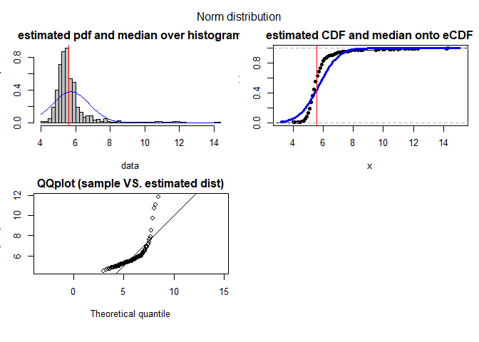
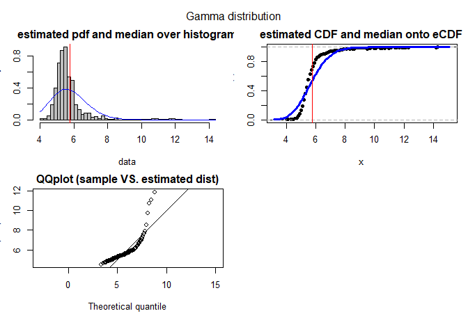
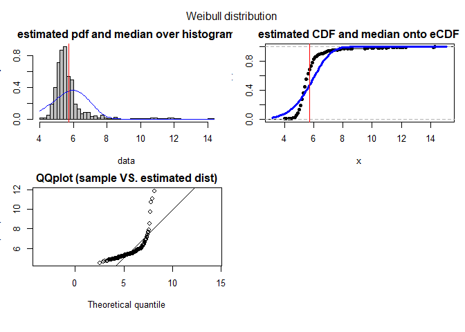
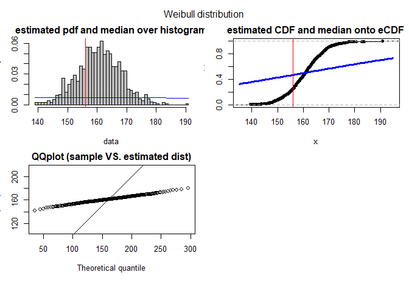
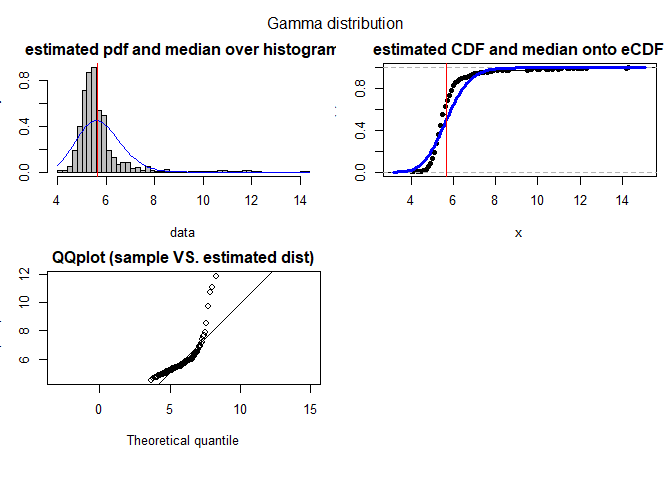
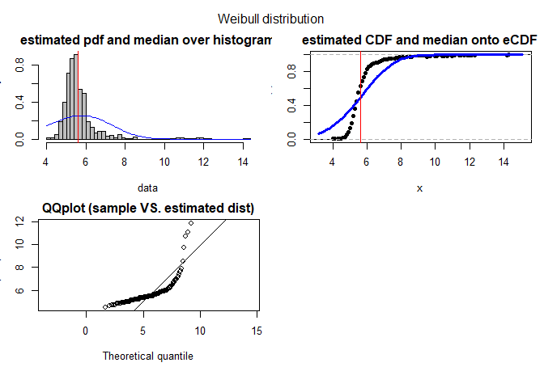
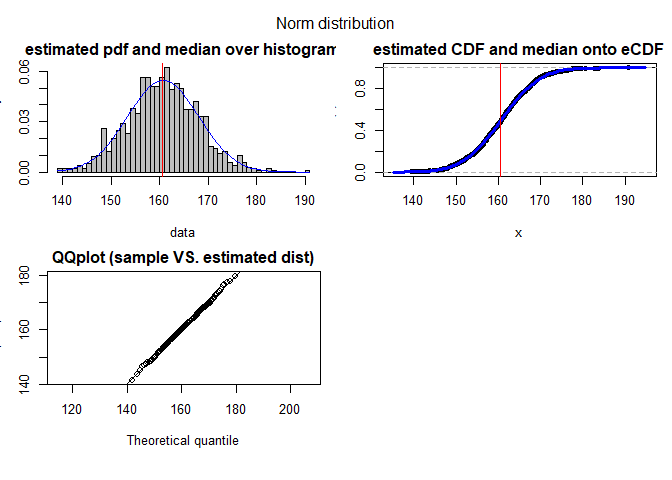
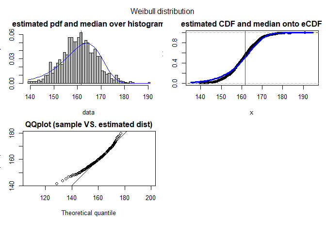

Modeling the unknown distribution with maximum likelihood and method of
moments
================
Hongyu Dai
2021/11/6

Maximum likelihood (MLE) and method of moments (MM) are two common
methods for constructing a model.

# 1. Introduction

In this Blog, I will write a tutorial in which I will explain to the
reader how one might use MLE and MM to model (a) Glycohemoglobin and (b)
Height of adult females.

I will compare and contrast the two methods in addition to comparing and
contrasting the choice of underlying distribution.

My goal is to let even a new comer to data science, could understand
these commonly used tools.

# 2. Questions

I am going to introduce you how to achieve the following questions:

1.  Show how to calculate estimates of parameters
2.  Provide visuals that show the estimated distribution compared to the
    empirical distribution
    -   Overlay estimated pdf onto histogram
    -   Overlay estimated CDF onto eCDF
    -   QQ plot (sample vs estimated dist)
3.  Explain how to calculate the median from the estimated distribution

For the above topics, I will apply both MLE and MM methods with 2 data:
(a) Glycohemoglobin (b) Height of adult females, and 3 distribution:
Normal, Gamma, Weibull.

# 3. Setting

## 1) Library Packages

``` r
library(stats4)
library(dplyr)
#install.packages("mixdist")
library(mixdist)
```

## 2) Data Selectd

For today’s problem, I am going to use the data from National Health and
Nutrition Examination Survey 2009-2010 (NHANES), which is available from
the Hmisc package.

Questions focus on Glycohemoglobin Height of adult females, so I just
need to select useful data columns, do so fundamental data processes,
like clean NA value, and rename data.

Note: For this case, in order to reduce the computational intensity, I
only select 1000 rows.

``` r
Hmisc::getHdata(nhgh)
d1 <- nhgh %>% 
  filter(sex == "female") %>% 
  filter(age >= 18) %>% 
  select(gh, ht) %>% 
  na.omit() %>% 
  filter(1:n()<=1000)   # only selct 1000 rows.
  
gh <- d1$gh
ht <- d1$ht
```

## 3) Question Analysis

By observing above questions, we can find that the questions can be
divided into two parts:

1.  Calculate estimates of parameters

2.  Draw plots.

I’ll build functions separately to maximize code efficiency.

For **calculate estimates of parameters** part, I will set two function
based on MM and MLE method separeately.

For **Draw plots** part, I will create a foundation plot function named
`hw7_plot`, which could fit different dataset and distribution. Let’s
start with this part.

# 4. Plot Function

In this function, I’m going to draw 3 plots for each dataset and
distribution:

-   Overlay estimated pdf and median onto histogram
-   Overlay estimated CDF and median onto eCDF
-   QQ plot (sample vs estimated dist)

I am going to take new parameters `dist` and `...` in this function so
that the function will work for any continuous distribution that has
`p`,`d`,`r`,`q` functions defined in R. I’ll use the following
parameters instead:

|     Parameter Name     |             Meaning             |
|:----------------------:|:-------------------------------:|
| pf + distribution name | gives the distribution function |
| df + distribution name |   gives the density function    |
| rf + distribution name |    generates random deviates    |
| qf + distribution name |   gives the quantile function   |

About how to calculate the median from the estimated distribution: We
can use `rf` function to generate random deviates and use `quantile`
function to find the 50% probabilities number, which is the median we
need.

``` r
hw7_plot <- function(data,dist,...){ #
  
  pf <- eval(parse(text=paste0("p",dist)))
  df <- eval(parse(text=paste0("d",dist)))
  rf <- eval(parse(text=paste0("r",dist)))
  qf <- eval(parse(text=paste0("q",dist)))

  # v. median
  N <- 200 # sample size
  median <- rf(N,...) %>% quantile(0.5) 
 
  par(mfrow=c(2,2), oma = c(2, 0, 2, 0),mar=c(4,3,2,1)) 
  
  # ii. Overlay estimated pdf onto histogram
  hist ( data , freq = FALSE ,col="grey",breaks=50,main="estimated pdf and median over histogram")
  curve ( df (x,... ), add = TRUE, col="blue" )
  abline(v=median,col='red')
  
  # iii.  Overlay estimated CDF onto eCDF
  plot(ecdf(data),main="estimated CDF and median onto eCDF")
  curve(pf (x,...  ) , add = TRUE, col="blue",lwd = 3)
  abline(v=median,col='red')  
  
  # iv. QQ plot (sample vs estimated dist)
  x <- qf((1:(N-1))/N,... )
  y <- quantile(data,probs = (1:(N-1))/N) 
  plot(x,y, asp = 1, xlab = "Theoretical quantile", ylab = "Sample quantile",main = "QQplot (sample VS. estimated dist)")
  abline(0,1)
  
  mtext(Hmisc::capitalize(paste0(dist," distribution")), side = 3, line = 0, outer = T)
}
```

# 5. Estimates of Parameters Function

There is two step:

1.  **Find out the relationship between the parameters of the three
    distributions and the mean & variance.**

-   For normal distribution, we just need its mean and variance;

-   For gamma distribution, it is know that
    *m**e**a**n* = *s**h**a**p**e* \* *s**c**a**l**e*, *v**a**r* = *s**h**a**p**e* \* *s**c**a**l**e*<sup>2</sup>

    so we can calculate that  
    $$shape = \\frac{mean^2}{var}, scale = \\frac{var}{mean}$$

-   For Weibull distirbution, it is know that
    $$mean=scale\*gamma(1+\\frac{1}{k}),var=scale^2\[gamma(1+\\frac{2}{k})-gamma(1+\\frac{1}{k})^2\]$$
    . We are going to use `weibullpar` funtion from `mixdist` package to
    calculate its shape and scale.

2.  **Apply into MM and MLE methods.**

## MM

In statistics, the method of moments is a method of estimation of
population parameters.

It starts by expressing the population moments (i.e., the expected
values of powers of the random variable under consideration) as
functions of the parameters of interest. Those expressions are then set
equal to the sample moments.

The number of such equations is the same as the number of parameters to
be estimated. Those equations are then solved for the parameters of
interest. The solutions are estimates of those parameters.

``` r
MM <- function(data,dist){
  # i. Estimates of parameters  
  xbar=mean(data)
  s2=var(data)
  
  ## norm
  if (dist=="norm"){return(hw7_plot(data,dist,mean = xbar , sd = sqrt(s2)))}
  
  ## gamma
  if (dist=="gamma"){return(hw7_plot(data,dist,shape = xbar^2/s2 , scale = s2/xbar))}
  
  ## weibull
  if (dist=="weibull"){return(hw7_plot(data,dist,shape = weibullpar(xbar, s2)[1,1], scale = weibullpar(xbar, s2)[1,2]) )}
}
```

## Figures generated by MM method

``` r
# gh

MM(gh,"norm")
MM(gh,"gamma")
```

<!-- -->

``` r
MM(gh,"weibull")
```

<!-- -->

``` r
# ht

MM(ht,"norm")
```

<!-- -->

``` r
MM(ht,"gamma")
```

<!-- -->

``` r
MM(ht,"weibull")
```

<!-- --><!-- -->

It can be seen that:

-   for `gh` dataset, the quality of three distribution fit is bad.

-   for `ht` dataset, the quality of normal distribution and gamma
    distribution fits well, but fit bad for weibull distribution.

## MLE

In the `mle()` function, there are two main parameters. The first
specifies a function to calculate the log likelihood, and it is below
`LL()` function. The parameters of the function must be parameters. I
named them a and b, indicating the two parameters involved in each
distribution. The calculation uses an iterative process, starting from
the initial guess of mle, and then refining the guess in turn until it
converges to mle.

The second parameter start of mle() specifies initial guess, that is,
the relationship formula between the parameters mentioned above and the
mean & variance.

``` r
MLE <- function(data,dist){
  # i. Estimates of parameters  
  xbar=mean(data)
  s2=var(data)
   
  LL <- function(a,b){
     df <- eval(parse(text=paste0("d",dist))) 
     fs <- df(data ,a , b , log = TRUE    ) 
     -sum(fs)
  }
  
  ##norm
  if (dist=="norm"){a=xbar;b=s2}

  ## gamma
  if (dist=="gamma"){a=xbar^2/s2;b=s2/xbar}

  ## weibull
  if (dist=="weibull"){a=weibullpar(xbar, s2)[1,1];b=weibullpar(xbar, s2)[1,2]}
  
  fit <- mle(LL, start = list(a=a,b=b), method = "L-BFGS-B",lower = c(0, 0.01))
  
  return(hw7_plot(data,dist,coef(fit)[1], coef(fit)[2]))
}
```

## Figures generated by MLE method

``` r
# gh
MLE(gh,"norm");
MLE(gh,"gamma");
```

<!-- -->

``` r
MLE(gh,"weibull")
```

<!-- -->

``` r
# ht
MLE(ht,"norm");
```

<!-- -->

``` r
MLE(ht,"gamma");
```

<!-- -->

``` r
MLE(ht,"weibull")
```

<!-- --><!-- -->

It can be seen that:

-   for `gh` dataset, the quality of three distribution fit is bad.

-   for `ht` dataset, the quality of three distribution fits well.

# Take-Home Messages

1.  For both methods, the `gh` dataset’s quality of the three
    distribution fits is bad.

2.  For both methods, the `ht` dataset’s quality of normal and gamma
    distribution fit is well.
