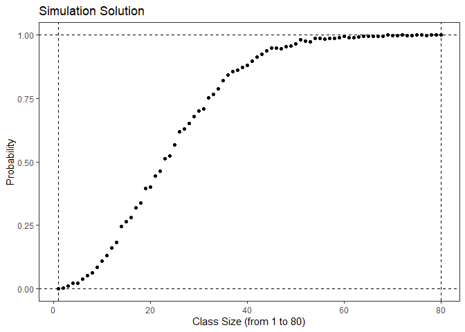
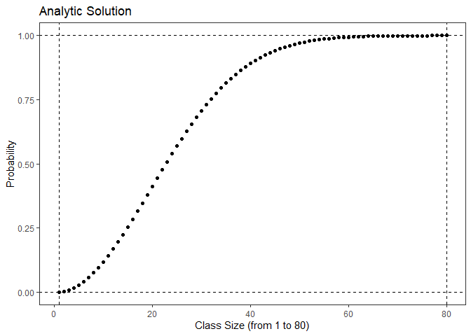
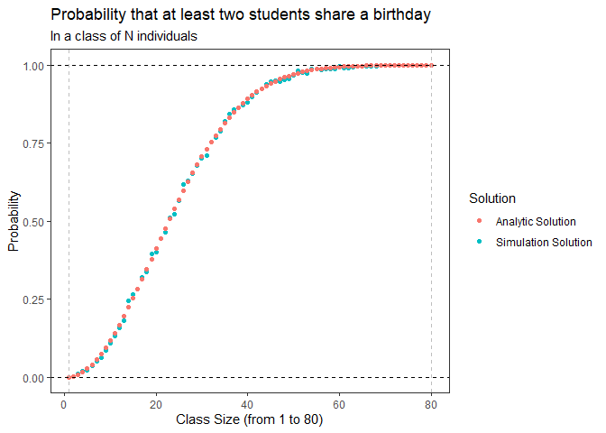

Birthday Problem
================
Hongyu Dai
2021/9/25

# Introduction

This blog will solve the birthday problem by both Simulation and
Analytic solutions and will also compare the pros and cons of the two
Solutions.

The purpose of this blog is to enable students with only basic
mathematical knowledge to understand how to solve the problem as well.

# Birthday Problem

## Problem Description

In a class of N individuals, what is the probability that at least two
students will share a birthday?

## Assumption

1.  A year only has 365 days (ignore leap day).

2.  The probability of a birthday is the same on any day of the year.

3.  Each student’s birthday is independent of the other.

4.  Class size: from 1 to 80.

# Solution

## Simulation

1.  Import package.

``` r
library(tidyverse)
library(ggplot2)
```

2.  Generate a class randomly. We will use R to create a class, after we
    input class size, then we will get each student’s id number and
    Corresponding birthday (crate randomly).

``` r
generate_class <- function(class_size){
  birthdays <- sample(1:365, class_size, replace = TRUE, prob = c(rep(1,365)))
  data.frame(student_id = 1:class_size, birthday = birthdays)
}
```

3.  Check whether they have the same birthday. We do a count of the data
    frame obtained in the second step and calculate the distinct
    birthday number. if the class size is bigger than the distinct
    birthday number, it means that there are more than two people
    sharing birthdays in this class.

``` r
check_birthday <- function(class){
  class_summary <- class %>% 
    summarize(n = n(), n_bday = n_distinct(birthday)) %>%  
    #n = class size, n_bday=distinct birthday number
    mutate(shared = n > n_bday) 
  class_summary[["shared"]]  
  #if they are more than 2 people share the same birthday, it will output with TRUE, else FALSE
}
```

4.  We calculated class sizes ranging from 1 to 80 students. To ensure
    the accuracy of the results, the results were averaged after 1000
    simulations. Finally we obtained the probability that in a class
    ranging from 1 to 80 students, the probability that at least two
    students share a birthday, named as p1.

``` r
set.seed(1)
p1=vector()
max_class_size=80
simulation_times=1000
for (m in 1:max_class_size){
  p <- replicate(simulation_times, m %>% generate_class %>% check_birthday)
  p1[m]=mean(p)
}
p1
```

    ##  [1] 0.000 0.002 0.010 0.017 0.029 0.056 0.065 0.061 0.099 0.122 0.136 0.163
    ## [13] 0.169 0.234 0.260 0.260 0.296 0.352 0.400 0.439 0.436 0.468 0.512 0.534
    ## [25] 0.553 0.589 0.656 0.613 0.670 0.682 0.714 0.752 0.770 0.797 0.818 0.849
    ## [37] 0.844 0.863 0.881 0.877 0.881 0.920 0.938 0.929 0.944 0.961 0.947 0.960
    ## [49] 0.962 0.975 0.974 0.982 0.985 0.987 0.991 0.984 0.989 0.990 0.995 0.993
    ## [61] 0.994 0.997 0.995 0.997 0.999 0.998 1.000 1.000 0.997 0.998 1.000 1.000
    ## [73] 1.000 1.000 0.999 1.000 1.000 1.000 0.999 1.000

For easy understanding, we show its trend by drawing a scatter plot:

``` r
ggplot()+
  geom_point(aes(x=1:max_class_size,y=p1))+
  geom_hline(aes(yintercept= c(0,1)), linetype="dashed", color = "black")+
  geom_vline(aes(xintercept=c(1,80)), linetype="dashed", color = "black") +
  labs(title='Simulation Solution',x='Class Size (from 1 to 80)',y='Probability')  +
  theme_bw()+
  theme(panel.grid.major=element_blank(), panel.grid.minor = element_blank())
```

<!-- -->

## Analytic

Through Analytic Solution, we can consider this problem from the
opposite side:

<center>
*P(at least two students share a birthday)* = 1 − *P (each student have different birthday)*
</center>

The problem turns to how to calculate the probability that each student
have different birthday. We assume that the student1’s birthday could be
anyday of 365 days, then the student2’s birthday should be 364 days of
365 days, et cetera. Finally, the student n’s birthday should be
(365-n+1) days of 365 days.

Let’s multiply these probabilities, we can get:

<center>

$\\textit{P (each student have different birthday)} = (\\frac{365}{365})\*(\\frac{364}{365})\*...\*(\\frac{365-n+1}{365})=\\frac{A\_{365}^n}{365^n}=\\frac{C\_{365}^n}{{365^n}n!}$

$\\textit{P(at least two students share a birthday)} = 1- \\textit{P (each student have different birthday)} =1-\\frac{C\_{365}^n}{{365^n}n!}$
</center>

Now that we have the formula to calculate the probability, we can
calculate it to get the corresponding probabilities for different class
sizes from 1 to 80.

Note: To facilitate the distinction, we name the probability here as p2

``` r
p2=vector()
max_class_size=80
  for (n in 1:max_class_size){
    p2[n]=1- (factorial(n)*choose(365,n))/((365)^n)
  }
p2 
```

    ##  [1] 0.000000000 0.002739726 0.008204166 0.016355912 0.027135574 0.040462484
    ##  [7] 0.056235703 0.074335292 0.094623834 0.116948178 0.141141378 0.167024789
    ## [13] 0.194410275 0.223102512 0.252901320 0.283604005 0.315007665 0.346911418
    ## [19] 0.379118526 0.411438384 0.443688335 0.475695308 0.507297234 0.538344258
    ## [25] 0.568699704 0.598240820 0.626859282 0.654461472 0.680968537 0.706316243
    ## [31] 0.730454634 0.753347528 0.774971854 0.795316865 0.814383239 0.832182106
    ## [37] 0.848734008 0.864067821 0.878219664 0.891231810 0.903151611 0.914030472
    ## [43] 0.923922856 0.932885369 0.940975899 0.948252843 0.954774403 0.960597973
    ## [49] 0.965779609 0.970373580 0.974431993 0.978004509 0.981138113 0.983876963
    ## [55] 0.986262289 0.988332355 0.990122459 0.991664979 0.992989448 0.994122661
    ## [61] 0.995088799 0.995909575 0.996604387 0.997190479 0.997683107 0.998095705
    ## [67] 0.998440043 0.998726391 0.998963666 0.999159576 0.999320753 0.999452881
    ## [73] 0.999560806 0.999648644 0.999719878 0.999777437 0.999823779 0.999860955
    ## [79] 0.999890668 0.999914332

``` r
ggplot()+
  geom_point(aes(x=1:max_class_size,y=p2))+
  geom_hline(aes(yintercept= c(0,1)), linetype="dashed", color = "black")+
  geom_vline(aes(xintercept=c(1,80)), linetype="dashed", color = "black") +
  labs(title='Analytic Solution',x='Class Size (from 1 to 80)',y='Probability')  +
  theme_bw()+
  theme(panel.grid.major=element_blank(), panel.grid.minor = element_blank())
```

<!-- -->

# Compare

Compare the scatter plots obtained by the two solutions:

``` r
ggplot()+
  geom_point(aes(x=1:max_class_size,y=p1,color='Simulation Solution'))+
  geom_point(aes(x=1:max_class_size,y=p2,color='Analytic Solution'))+
  geom_hline(aes(yintercept= c(0,1)), linetype="dashed", color = "black")+
  geom_vline(aes(xintercept=c(1,80)), linetype="dashed", color = "grey") +
  labs(title='Probability that at least two students share a birthday',subtitle='In a class of N individuals',x='Class Size (from 1 to 80)',y='Probability',color='Solution')  +
  theme_bw()+
  theme(panel.grid.major=element_blank(), panel.grid.minor = element_blank())
```

<!-- -->

We can find that they each have certain pros and cons.

## Simulation Solution

Pros

-   Study the behavior of a class without building it.

-   Results are accurate in general, compared to analytical model.

Cons

-   Large time cost

-   Since the birthdays are generated randomly, the randomness is large
    and sometimes it is difficult to interpret the simulation results.

-   When the number of simulations is small, the results tend to have
    large errors. As the number of simulations increases, the accuracy
    improves

## Analytic Solution

Pros

-   Fast running speed

-   Accurate results

Cons

-   Requires user to have probability theory knowledge
